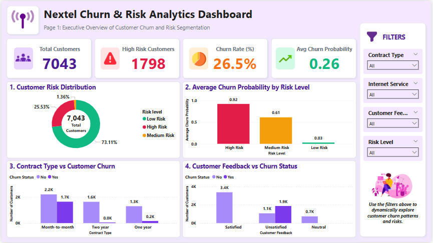
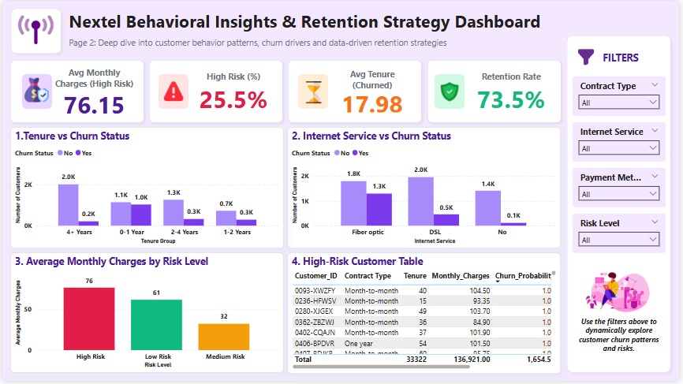
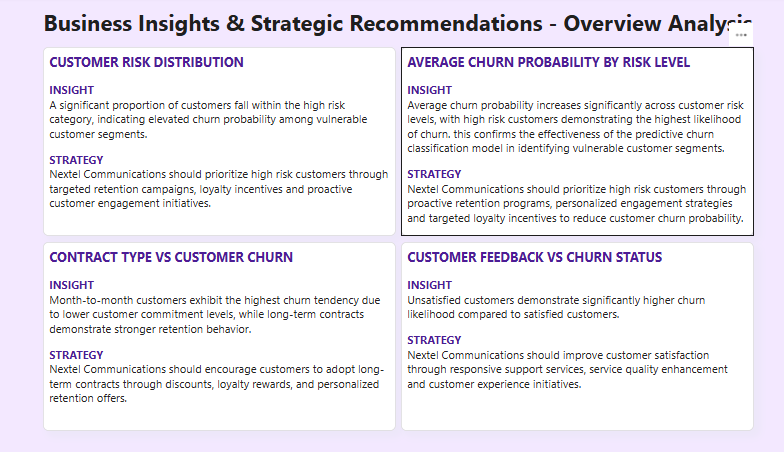

Customer Churn Analysis & Prediction

Project Overview

This project analyzes customer churn in a telecommunications company to understand customer behavior and identify patterns associated with churn.

The project covers exploratory data analysis, data preparation, SQL analysis, machine learning, and Power BI visualization.

Objectives

- Explore customer data and identify patterns related to churn.
- Prepare and clean the dataset for analysis.
- Use SQL to analyze customer data and create useful views.
- Develop a machine learning model for churn prediction.
- Create a Power BI dashboard to present key findings and insights.

Tools & Technologies

- Python
- Pandas
- NumPy
- Matplotlib
- Seaborn
- SQL
- Power BI
- Scikit-learn

Project Files

"Customer Churn Analysis EDA" - Exploratory data analysis and visualization

"Churn Prediction ML" - Machine learning analysis and churn prediction

"Telecom Churn SQL" - SQL queries and analytical views

"Customer Churn Cleaned with Risk Levels.csv" - Cleaned dataset used for analysis

"Customer Churn Dashboard" - Power BI dashboard presenting key insights

Key Areas of Analysis

The analysis focuses on customer characteristics, service usage, contract information, and other factors that may be associated with customer churn.

Project Outcome

The project combines data analysis, SQL, machine learning, and visualization to better understand customer churn and present findings that can support customer retention efforts.

Dashboard Preview

Dashboard Page 1

Dashboard Page 2

Insights & Recommendations — Page 1

Insights & Recommendations — Page 2

[Business Insights and Strategic Recommendations - Retention Analytics](./insights-recommendations-2.PNG)
